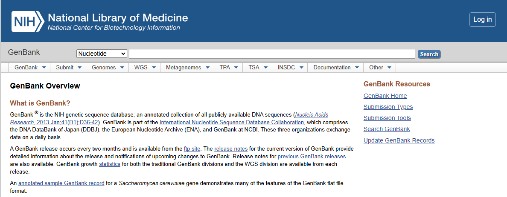
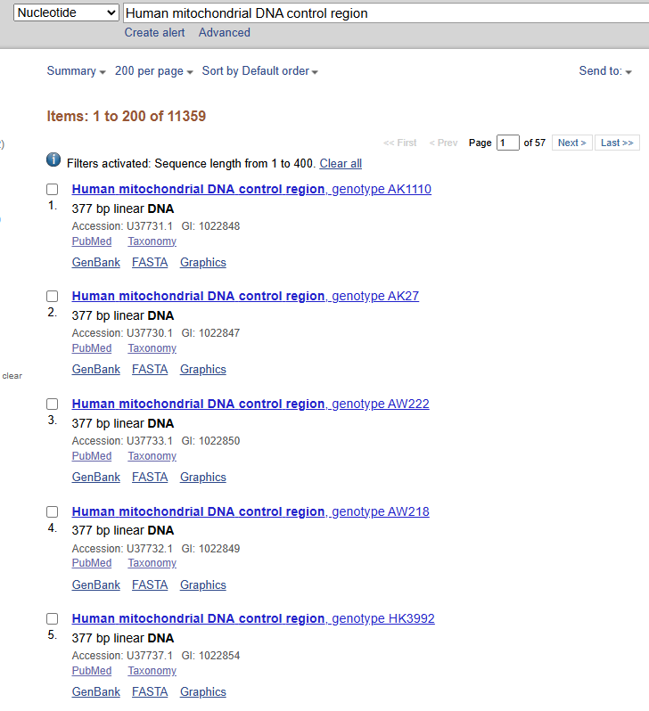
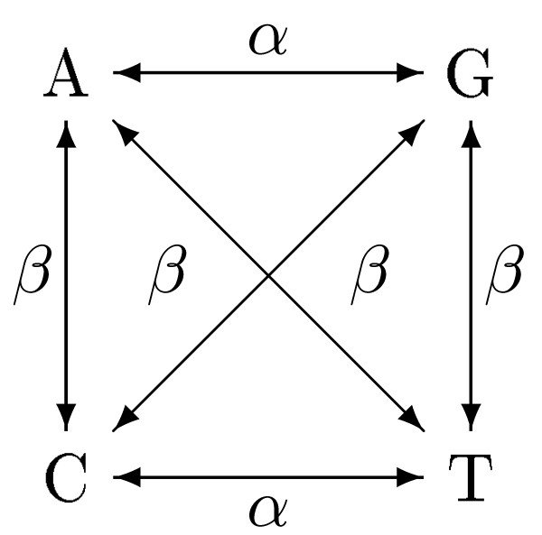

# Trabajos en el Laboratorio I

En el laboratorio de Antropología Molecular, es común trabajar con datos de secuencias de ADN mitocondrial (mtDNA). En esta sección, aprenderemos a descargar datos desde GenBank y a leerlos en R para su posterior análisis.

*Nota: Asegúrate de tener listos tus archivos de secuencias en formato FASTA antes de comenzar. Si no los tienes, puedes continuar siguiendo las instrucciones que daré a continuación.*

## Descarga de datos desde GenBank

**GenBank** es una base de datos pública de secuencias de ADN mantenida por el NCBI [National Center for Biotechnology Information; @Sayers2022]. Para descargar datos de GenBank, puedes utilizar la función `rentrez` en R o hacerlo manualmente a través de la página web del NCBI. 
Para descargar los datos manualmente, naveguen a la página de NCBI y seleccionen el formato FASTA como se muestra a continuación:



Lo primero que debemos hacer es buscar una secuencia de interés. Para esto, podemos utilizar el número de acceso (accession number) o el nombre del organismo. En este caso, decidí usar solo las secuencias de mtDNA de la región control, que es una región comúnmente utilizada en estudios de genética de poblaciones. Para esto, busqué "Human mitochondrial DNA control region " en la barra de búsqueda y seleccioné las secuencias que me interesaban. 



Una vez que tenga identificadas las secuencias de interés, puedo descargarlas directamente, sin embargo, para este ejercicio, usaremos el paquete `ape`para descargar las secuencias directamente desde R, lo que nos permitirá automatizar el proceso y evitar errores manuales. Para ello, debo identificar el número de acceso de la secuencia que quiero descargar. En este caso, usaré la secuencia con el número de acceso "U37731.1", que corresponde a una secuencia de mtDNA humana de la región control.


```{r}
# Cargamos el paquete "ape"
library(ape)
# Descargamos la secuencia de interés utilizando su número de acceso
secuencia_1 <- read.GenBank("U37731.1")
# Visualizamos la secuencia descargada
print(secuencia_1)
```

Sin embargo, es necesario que se descarguen al menos un número de secuencias para que el código funcione correctamente. Para esto, podemos descargar varias secuencias utilizando sus números de acceso. Por ejemplo, podemos descargar las siguientes secuencias:

```{r}
# Descargamos varias secuencias utilizando sus números de acceso
secuencias <- read.GenBank(c("U37731.1", "U37730.1", "U37733.1", "U37737.1", "U37752.1",
                             "U37751.1", "U37739.1", "U37743.1")) 
# Visualizamos las secuencias descargadas
print(secuencias)
```

Sin embargo, es importante mencionar que hay una secuencia que no tiene el mismo tamaño que las demas, lo que puede causar problemas en un analisis posterior. Para evitar esto, es recomendable descargar secuencias que tengan el mismo tamaño o recortarlas para que tengan el mismo tamaño antes de analizarlas o en su defecto, hacer un alineamiento de secuencias para que todas tengan el mismo tamaño. Aquí haremos un alineamiento de secuencias utilizando el paquete `msa` para asegurarnos de que todas las secuencias tengan el mismo tamaño antes de analizarlas.

# Alineamiento de secuencias

El alineamiento requiere de un paquete adicional llamado `msa`, que se debe de instalar antes de continuar. Para instalarlo, puedes usar el siguiente código:

```{r}
#| message: false
#| warning: false
    # Instalación de Bioconductor
if (!requireNamespace("BiocManager", quietly = TRUE))
    install.packages("BiocManager")
    # Instalación del paquete msa
BiocManager::install("msa")
```

*Bioconductor* es un proyecto de software de código abierto que proporciona herramientas para el análisis de datos genómicos y biológicos. El paquete `msa` es una herramienta de alineamiento de secuencias que permite alinear múltiples secuencias de ADN, ARN o proteínas. Para alinear las secuencias descargadas, podemos usar la función `msa` del paquete `msa`.

**Nota: Para que el alineamiento funcione correctamente, el paquete `msa` requiere que las secuencias estén en un formato "AAStringSet" o "DNAStringSet". Sin embargo, el paquete `ape` devuelve las secuencias en un formato "DNAbin". Por lo tanto, es necesario transformar las secuencias descargadas en un formato compatible con el paquete `msa` antes de alinearlas. Para esto, podemos usar la función `as.DNAbin` del paquete `ape` para transformar las secuencias en un formato compatible con el paquete `msa`:

```{r}
#| message: false
#| warning: false
suppressPackageStartupMessages(library(ape))
suppressPackageStartupMessages(library(msa))
suppressPackageStartupMessages(library(Biostrings))
suppressPackageStartupMessages(library(phangorn))

# Descargamos las secuencias utilizando sus números de acceso
secuencias_crudas <- read.GenBank(c("U37731.1", "U37730.1", "U37733.1", "U37737.1", "U37752.1",
                             "U37751.1", "U37739.1", "U37743.1"))

# Este paso es escencial para convertir las secuencias al formato que el paquete msa requiere. El paquete ape devuelve las secuencias en un formato "DNAbin", por lo que es necesario transformarlas a un formato compatible con el paquete msa, como "DNAStringSet". Para esto, podemos usar la función as.character para transformar las secuencias en un formato compatible con el paquete msa.
secuencias_letras <- as.character(secuencias_crudas) # Transformamos las secuencias en un formato compatible con el paquete msa

# Esto convierte c("A", "T", "G") en "ATG" para cada individuo
secuencias_texto <- sapply(secuencias_letras, paste, collapse = "")

# Convertimos el texto limpio al formato que msa exige
secuencias_biostrings <- DNAStringSet(secuencias_texto)

# Alineamos las secuencias utilizando la función msa
alineamiento <- msa(secuencias_biostrings, method = "Muscle")

# Visualizamos el alineamiento
print(alineamiento)
```

¡Felicidades! Has generado un alineamiento de secuencias utilizando el paquete `msa`. Este alineamiento es esencial para realizar análisis posteriores, como la construcción de árboles filogenéticos o el cálculo de distancias genéticas entre las secuencias. En la próxima sección, aprenderemos a construir un árbol filogenético utilizando el alineamiento generado.

# Ejercicio
1. Descarga al menos entre 10 a 30 secuencias de de DNA diferentes organismos (pueden ser humanos o de otras especies) utilizando el paquete `ape` o manualmente desde GenBank.
**Nota: Asegúrate de que las secuencias descargadas sean de la misma región del ADN para evitar problemas en el análisis posterior. Por ejemplo, puedes descargar secuencias de la región control del mtDNA de diferentes individuos o especies. Además, evita usar secuencias mayores a 1000 pb para no sobrecargar el sistema de tu computadora.**
2. Alinea las secuencias descargadas utilizando el paquete `msa` y visualiza el alineamiento.
3. Compara el alineamiento generado con las secuencias originales para asegurarte de que todas las secuencias tengan el mismo tamaño y que el alineamiento se haya realizado correctamente.
4. Guarda el alineamiento en un archivo FASTA para su posterior análisis. Para ello, necesitas usar la función `writeXStringSet` del paquete `Biostrings` para guardar el alineamiento en un archivo FASTA. Aquí te dejo un ejemplo de cómo hacerlo:
```{r}
# Guardamos el alineamiento en un archivo FASTA
alineamiento_texto <- as(alineamiento, "DNAStringSet")

# El archivo se va a guardar donde sea que tengas tu proyecto de R. Si quieres guardarlo en una carpeta específica, solo tienes que especificar la ruta completa en el argumento filepath. 
writeXStringSet(alineamiento_texto, filepath = "../Results/alineamiento.fasta")
```

# Analisis de Distancias Genéticas

Una vez que tenemos nuestro alineamiento de secuencias, podemos calcular las distancias genéticas entre las secuencias para entender las relaciones evolutivas entre ellas. Para esto, podemos usar la función `dist.dna` del paquete `ape`, que calcula las distancias genéticas entre las secuencias alineadas utilizando diferentes modelos de sustitución de nucleótidos. Anteriormente, era necesario transformar el alineamiento al formato "DNAbin" para que la función `dist.dna` pueda trabajar con él. Sin embargo, el paquete `msa` devuelve el alineamiento en un formato "MsaDNAMultipleAlignment", por lo que es necesario transformar el alineamiento al formato "DNAbin" antes de calcular las distancias genéticas. Para esto, podemos usar la función `as.DNAbin` del paquete `ape` para transformar el alineamiento al formato "DNAbin":

```{r}
# Transformamos el alineamiento al formato "DNAbin"
alineamiento_dnabin <- as.DNAbin(alineamiento) 

# Calculamos las distancias genéticas entre las secuencias utilizando la función dist.dna
distancias_geneticas <- dist.dna(alineamiento_dnabin, model = "K80") # Puedes cambiar el modelo de sustitución de nucleótidos si lo deseas

# Visualizamos las distancias genéticas
print(distancias_geneticas)
```

En este punto, estas funciones te serán conocidas puesto que has trabajado con ellas en el Laboratorio de Antropología Molecular. La distancia genética usada en este modelo es el modelo de Kimura de 2 parámetros (K80), que asume que las sustituciones de nucleótidos pueden ser transiciones (cambio entre purinas o entre pirimidinas) o transversiones (cambio entre purina y pirimidina), y que las tasas de sustitución son diferentes para cada tipo de cambio [@Elias2007].



**Nota: El modelo de Kimura de 2 parámetros es uno de los modelos más simples para calcular distancias genéticas, pero existen otros modelos más complejos que pueden ser utilizados dependiendo del tipo de datos y del análisis que se quiera realizar. Es importante elegir el modelo adecuado para obtener resultados precisos y confiables. Discutirlo con tu tutor(a) es muy importante.**

Ahora que tenemos las distancias genéticas, es necesario observar gráficamente las distancias entre secuencias. Podemos hacer esto generando un plot de las distancias genéticas utilizando un plot de calor (heatmap) o un dendrograma. Para generar un heatmap, podemos usar la función `heatmap` del paquete `stats`:

```{r}
# Generamos un heatmap de las distancias genéticas
heatmap(as.matrix(distancias_geneticas), symm = TRUE, col = colorRampPalette(c("white", "red"))(100), margins = c(5, 5))
```
Los colores en el heatmap representan la magnitud de las distancias genéticas entre las secuencias, donde el blanco representa distancias genéticas cercanas a cero (secuencias muy similares) y el rojo representa distancias genéticas mayores (secuencias más diferentes).

Para generar un dendrograma, podemos usar la función `hclust` del paquete `stats`:

```{r}
# Generamos un dendrograma de las distancias genéticas
dendrograma <- hclust(distancias_geneticas, method = "average")
plot(dendrograma, main = "Dendrograma de Distancias Genéticas", xlab = "Secuencias", ylab = "Distancia Genética")
```
El dendrograma muestra las relaciones evolutivas entre las secuencias, donde las secuencias que están más cercanas entre sí en el dendrograma tienen distancias genéticas menores, lo que sugiere que están más relacionadas evolutivamente. Las secuencias que están más alejadas entre sí en el dendrograma tienen distancias genéticas mayores, lo que sugiere que están menos relacionadas evolutivamente.

# Algoritmos de construcción de árboles filogenéticos

Una vez que tenemos las distancias genéticas entre las secuencias, podemos construir un árbol filogenético para visualizar las relaciones evolutivas entre las secuencias. Para esto, podemos usar diferentes algoritmos de construcción de árboles filogenéticos, como el método de UPGMA (Unweighted Pair Group Method with Arithmetic Mean) o el método de Neighbor-Joining. En este caso, usaremos el método de UPGMA para construir el árbol filogenético utilizando la función `upgma` del paquete `phangorn`:

```{r}
# Cargamos el paquete "phangorn" para usar la función upgma
library(phangorn)
# Construimos el árbol filogenético utilizando el método de UPGMA
tree_upgma <- upgma(distancias_geneticas)
# Visualizamos el árbol filogenético
plot(tree_upgma, main = "UPGMA")
```

Y también podemos usar el método de Neighbor-Joining para construir el árbol filogenético utilizando la función `nj`:
```{r}
# Construimos el árbol filogenético utilizando el método de Neighbor-Joining
tree_nj <- nj(distancias_geneticas)
# Visualizamos el árbol filogenético
plot(tree_nj, main = "Neighbor-Joining")
```

Hay que recordar que UPGMA asume que las tasas de evolución son constantes a lo largo del tiempo (reloj molecular), lo que puede no ser siempre el caso, mientras que Neighbor-Joining no hace esta suposición y puede ser más adecuado para datos con tasas de evolución variables. Es importante elegir el método adecuado para construir el árbol filogenético dependiendo de las características de los datos y del análisis que se quiera realizar. Discutirlo con tu tutor(a) es muy importante.

Por otra parte, es importante generar un árbol filogenético con soporte estadístico para evaluar la confiabilidad de las relaciones evolutivas entre las secuencias. Para esto, podemos usar el método de bootstrap para generar múltiples réplicas del árbol filogenético y calcular el soporte estadístico para cada nodo del árbol. Para esto, podemos usar la función `bootstrap` del paquete `phangorn`:

```{r}
fun_nj <- function(x) nj(dist.dna(x, model = "K80"))
# Generamos un árbol filogenético con soporte estadístico utilizando el método de bootstrap

bs_values <- boot.phylo(tree_nj, alineamiento_dnabin, fun_nj, B = 100)# B es el número de réplicas de bootstrap
# Visualizamos el árbol filogenético con soporte estadístico
plot(tree_nj, main = "Árbol Final con Soporte de Bootstrap")
nodelabels(bs_values, adj = c(1.2, -0.5), frame = "n", cex = 0.8,
           col = ifelse(bs_values > 70, "darkgreen", "red"))  # Agregamos los valores de bootstrap a los nodos del árbol
```

En este código, `boot.phylo` genera múltiples réplicas del árbol filogenético utilizando el método de bootstrap y calcula el soporte estadístico para cada nodo del árbol. Los valores de bootstrap se agregan a los nodos del árbol utilizando la función `nodelabels`, donde los nodos con valores de bootstrap mayores a 70 se colorean en verde oscuro, indicando un soporte estadístico fuerte, mientras que los nodos con valores de bootstrap menores o iguales a 70 se colorean en rojo, indicando un soporte estadístico débil. Es importante interpretar los valores de bootstrap con cautela, ya que un valor de bootstrap alto no garantiza que la relación evolutiva representada por ese nodo sea correcta, pero sí sugiere que esa relación es más confiable que un nodo con un valor de bootstrap bajo. 

# Ejercicio 2:
**Recuerda que estos datos deben ser generados a partir de los que descargaste anteriormente.**
1. Construye un árbol filogenético utilizando el método de UPGMA y otro utilizando el método de Neighbor-Joining.
2. Compara los árboles filogenéticos generados con los diferentes métodos y discute las diferencias y similitudes entre ellos.
3. Genera un árbol filogenético con soporte estadístico utilizando el método de bootstrap y discute la confiabilidad de las relaciones evolutivas entre las secuencias basándote en los valores de bootstrap obtenidos.
4. Guarda los árboles filogenéticos generados en formato Newick para su posterior análisis. Para esto, puedes usar la función `write.tree` del paquete `ape` para guardar los árboles filogenéticos en formato Newick. Aquí te dejo un ejemplo de cómo hacerlo:
```{r}
# Guardamos el árbol filogenético generado con el método de UPGMA en formato New
write.tree(tree_upgma, file = "../Results/arbol_upgma.newick")
# Guardamos el árbol filogenético generado con el método de Neighbor-Joining en formato Newick
write.tree(tree_nj, file = "../Results/arbol_nj.newick")
```
# Referencias