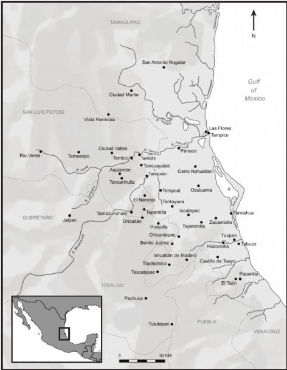
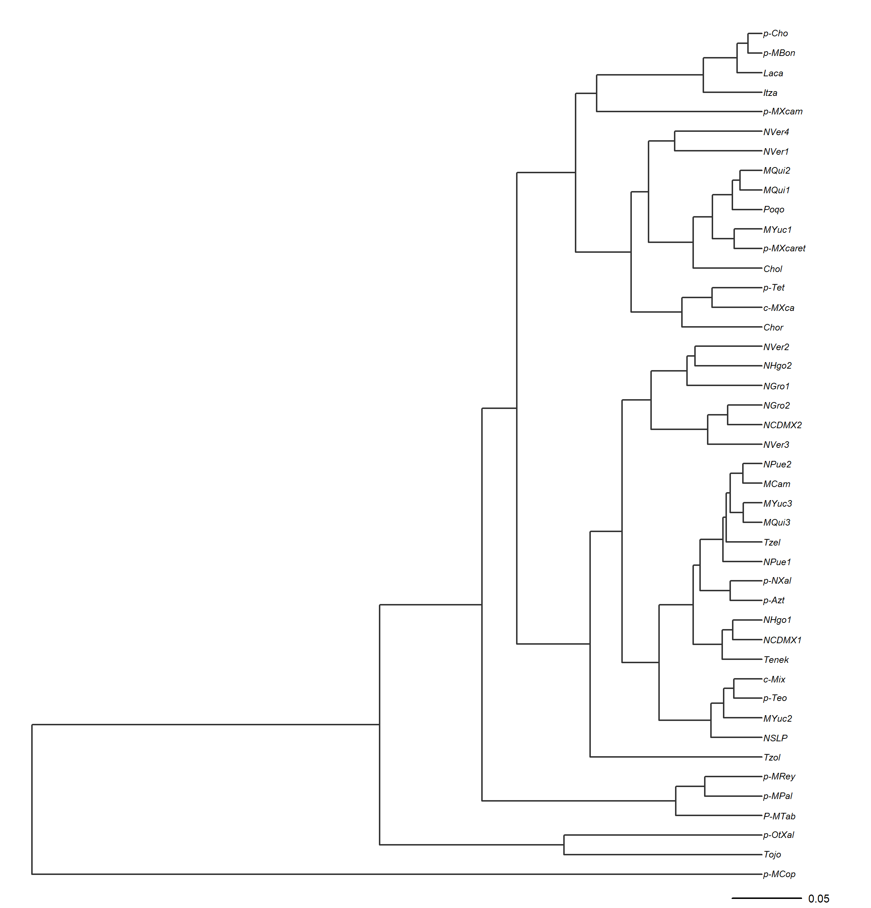
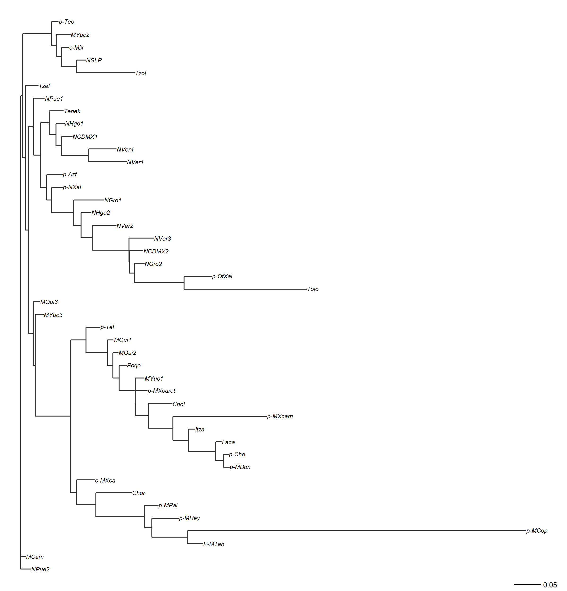
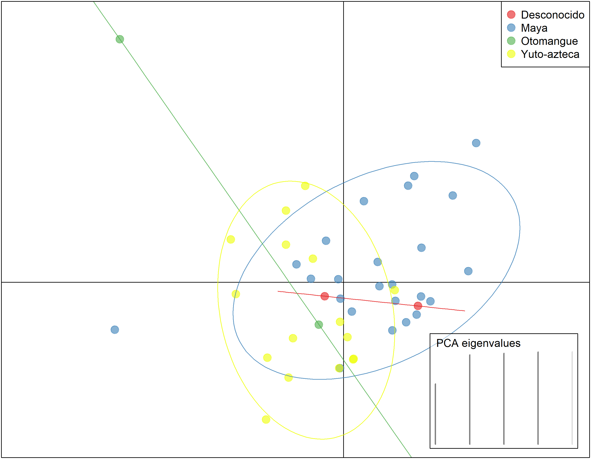

# ¿Qué pasa si solo tengo frecuencias de haplogrupos?

Las frecuencias de los haplogrupos pueden ser útiles para algunos análisis. En genética de poblaciones, llevan usándose desde la década de los 1920, cuando los primeros estudios sobre genética aplicado a ganado bovino resultó ser útil para la industria de la carne. Sin embargo, cuentan con ciertas limitantes. 

En Antropología Molecular, se ha asociado la proporción de los haplogrupos con la proporción de ancestría de una población. Por ejemplo, @lorenz1996 y @smith1999 demostraron estadísticamente la relación que existe entre la proporción de haplogrupos con la asociación lingüística, cultural y geográfica de las poblaciones estudiadas. 

Sin embargo, esta asociación no es tan simple como parece. En primer lugar, la proporción de haplogrupos no siempre refleja la proporción de ancestría de una población. Esto se debe a que los haplogrupos pueden ser compartidos entre diferentes poblaciones debido a la migración, el mestizaje o la deriva genética. Por ejemplo, un haplogrupo común en una población puede ser raro en otra población debido a la migración o al mestizaje. Además, la proporción de haplogrupos puede ser influenciada por factores como la selección natural, la deriva genética o la mutación, lo que puede distorsionar la relación entre la proporción de haplogrupos y la proporción de ancestría.

# Evidencia de uso de frecuencias de haplogrupos como proxy de distancia genética

Existen tres puntos a favor del uso de las frecuencias mitocondriales como marcador de distancia genética:
1. **Tasa de mutación alta**: El mtDNA tiene una tasa de mutación mucho más alta que el DNA nuclear (de 10 a 100 veces más alta, @brown1979), lo que permite detectar diferencias genéticas entre poblaciones en un período de tiempo relativamente corto.
2. **Herencia materna**: El mtDNA se hereda exclusivamente por vía materna, lo que significa que no se mezcla con el DNA de otros individuos a través de la reproducción sexual. Esto permite rastrear linajes maternos y estudiar la historia evolutiva de las poblaciones [@Wallace2007].
3. **Sensibilidad a eventos demográficos**: Las frecuencias de haplogrupos pueden ser sensibles a eventos demográficos como migraciones, cuellos de botella y expansiones poblacionales, lo que puede proporcionar información sobre la historia evolutiva de las poblaciones [@cavalli1994].

Si bien existen estas ventajas son importantes, también es cierto que el uso de las frecuencias de los haplogrupos presenta limitaciones significativas. Por otra parte, el estudio del mtDNA en poblaciones humanas nunca antes estudiadas ha demostrado ser útil para entender la historia de las poblaciones indígenas mexicanas. Por ejemplo, @Andres2014 encontró que las poblaciones indígenas mexicanas tienen una alta diversidad de haplogrupos mitocondriales, lo que sugiere una historia evolutiva compleja y una gran diversidad genética. Además, @Gonzalez-Oliver2017a encontró que las poblaciones indígenas mexicanas tienen una alta proporción de haplogrupos mitocondriales específicos de América, lo que sugiere una historia evolutiva única para estas poblaciones.

En esta sección, analizaremos los resultados obtenidos a partir de las frecuencias de los haplogrupos mitocondriales de las poblaciones indígenas mexicanas. Para ello, se utilizaron los datos obtenidos por @lopez-hernandez2019, quien analizó los haplogrupos mitocondriales de la población teenek que habita la Huasteca Potosina, México.



# Recomendaciones del tratamiento de tus datos

Independientemente de si estos son datos de haplogrupos mitocondriales o haplotipos de la región control, es importante tener en cuenta las siguientes recomendaciones para el tratamiento de tus datos:
1. **Tipo de datos**: Tu tabla de datos (*data frame* en R) debe contener una columna con los nombres de las poblaciones (*pop* en el data frame que se usará en el ejemplo), una serie de columnas nombradas con los haplogrupos o haplotipos a usar (*A*, *B*, *C*, etc.). Estas columnas tendrán **la frecuencia de cada haplogrupo o haplotipo en cada población**. Es importante que las frecuencias estén expresadas como proporciones (es decir, entre 0 y 1) y no como porcentajes (entre 0 y 100).
2. **Número de poblaciones**: Para obtener resultados confiables, es recomendable tener al menos 5 poblaciones en tu análisis. Esto se debe a que con un número muy bajo de poblaciones, las estimaciones de distancia genética pueden ser inestables y no representativas de la diversidad genética real.
3. **Columnas con datos lingüísticos, culturales o geográficos**: Si deseas analizar la relación entre las frecuencias de haplogrupos y factores como la lengua, la cultura o la geografía, es importante incluir columnas adicionales en tu data frame que contengan esta información. Por ejemplo, podrías tener una columna llamada *lengua* que indique el grupo lingüístico al que pertenece cada población, una columna llamada *cultura* que indique el grupo cultural al que pertenece cada población, y una columna llamada *geografia* que indique la región geográfica donde se encuentra cada población. Esto te permitirá realizar análisis estadísticos para evaluar la asociación entre las frecuencias de haplogrupos y estos factores.
4. **Formato de los datos**: Asegúrate de que tus datos estén en un formato adecuado para la lectura en R. En este ejemplo, usaremos un archivo CSV. Si bien es posible usar otros formatos, como Excel o archivos de texto, el formato CSV es ampliamente compatible y fácil de manejar en R.

# Análisis de las frecuencias de haplogrupos mitocondriales
## Test exacto de Fisher para evaluar la asociación entre frecuencias de haplogrupos y factores como la lengua, la cultura o la geografía

Como primer paso, cargaremos los datos de las frecuencias de los haplogrupos mitocondriales en el análisis genético de la población teenek. Para ello, usaremos la función `read.csv()` de R para leer el archivo CSV que contiene los datos. Asegúrate de que el archivo esté en el mismo directorio que tu script de R o proporciona la ruta completa al archivo.
```{r}
# Cargar los datos de frecuencias de haplogrupos mitocondriales
datos_abs <- read.csv("data/pop_abs.csv", header = TRUE)
# Mostrar las primeras filas del data frame para verificar que se cargó correctamente
head(datos_abs)
```
Como observarás, el data frame contiene una columna llamada *pop* con los nombres de las poblaciones y varias columnas con los nombres de los haplogrupos (por ejemplo, *A*, *B*, *C*, etc.) que contienen **el numero de individuos** de cada haplogrupo en cada población. Esto es necesario para el análisis que realizaremos a continuación, pero es importante recordar que para otros análisis, como el cálculo de distancias genéticas, es necesario convertir estos números en frecuencias (proporciones) dividiendo cada conteo por el total de individuos en cada población.

Ahora, haremos un análisis llamado "Test exacto de Fisher", para evaluar si existe una asociación significativa entre el número de individuos de cada haplogrupo y la lengua, la cultura o la geografía. Es una primera exploración para evaluar si hay alguna relación entre las poblaciones. Para ello, usaremos la función `fisher.test()` de R. Esta función realiza el test exacto de Fisher para tablas de contingencia, lo que nos permitirá evaluar la asociación entre las frecuencias de los haplogrupos y los factores mencionados:

```{r}
# 1. Agrupar y sumar los conteos absolutos de individuos por familia lingüística
# Reemplaza A, B, C, D con los nombres de las columnas de tus haplogrupos
tabla_agrupada <- aggregate(cbind(A, B, C, D, Otros) ~ fam_ling, data = datos_abs, FUN = sum)

# 2. El test de Fisher pide una matriz numérica pura, así que quitamos 
# la primera columna (el texto de las lenguas) y la pasamos a nombres de fila (rownames)
matriz_contingencia <- as.matrix(tabla_agrupada[, -1])
rownames(matriz_contingencia) <- tabla_agrupada$fam_ling

# 3. Verificamos que la tabla tenga sentido biológico antes del test
print(matriz_contingencia)

# 4. Correr el test exacto de Fisher
# OJO: simulate.p.value = TRUE es VITAL en genética de poblaciones porque 
# las tablas mayores a 2x2 hacen que la memoria de R colapse al calcular factoriales exactos.
resultado_lengua <- fisher.test(matriz_contingencia, simulate.p.value = TRUE, B = 10000)

print(resultado_lengua)
```

El resultado del test de Fisher nos dará un valor *p* que nos indicará si existe una asociación significativa entre las frecuencias de los haplogrupos y la familia lingüística. Si el valor *p* es menor que un umbral comúnmente utilizado (por ejemplo, 0.05), podemos concluir que hay una asociación significativa entre las frecuencias de los haplogrupos y la familia lingüística. De lo contrario, no podemos rechazar la hipótesis nula de que no hay asociación. En este caso, obtuvimos un valor *p* de 9.999e-05 ( o 0.00009), lo que indica que hay una asociación significativa entre las frecuencias de los haplogrupos y la familia lingüística en las poblaciones estudiadas.
Puedes repetir este proceso para evaluar la asociación entre las frecuencias de los haplogrupos y otros factores como la cultura o la geografía, simplemente cambiando la variable de agrupación en el paso 1 (por ejemplo, usando *cultura* o *geografia* en lugar de *fam_ling*).

*NOTA*: Es importante tener en cuenta que el test de Fisher es sensible a la distribución de los datos y puede no ser adecuado para tablas con frecuencias muy bajas. En casos donde las frecuencias son muy bajas, es posible que sea necesario usar otros métodos estadísticos o agrupar los datos de manera diferente para obtener resultados más confiables.

*NOTA 2*: Este test es ligeramente diferente al hecho con AMOVA, que se basa en la varianza genética entre y dentro de las poblaciones. El test de Fisher se basa en la asociación entre frecuencias de haplogrupos y factores como la lengua, la cultura o la geografía, mientras que AMOVA evalúa la estructura genética de las poblaciones en función de la varianza genética. Ambos enfoques pueden ser complementarios para entender la historia evolutiva de las poblaciones, pero es importante elegir el método adecuado según el tipo de datos y las preguntas de investigación que se quieran responder.

## Análisis de distancias genéticas a partir de frecuencias de haplogrupos mitocondriales

Lo siguiente es hacer una matriz de distancias genéticas a partir de las frecuencias de los haplogrupos mitocondriales. Para ello, usaremos la función `dist()` de R para calcular las distancias genéticas entre las poblaciones. Antes de calcular las distancias, es importante convertir los conteos absolutos de individuos en frecuencias (proporciones) dividiendo cada conteo por el total de individuos en cada población (esto ya lo hice previamente y lo separé en un archivo llamado `pop_freq.csv`). Luego, podemos usar la función `dist()` para calcular las distancias genéticas entre las poblaciones basándonos en estas frecuencias.
```{r}
# Cargar los datos de frecuencias de haplogrupos mitocondriales
datos_freq <- read.csv("data/pop_freq.csv", header = TRUE)
# Seleccionar solo las columnas de frecuencias numéricas
frecuencias <- datos_freq[, 2:6]
# Asignar los nombres ANTES de calcular
rownames(frecuencias) <- datos_freq$pop
# Calcular la matriz de distancias genéticas
# 'dist' heredará automáticamente los nombres que acabamos de asignar
distancias <- dist(frecuencias, method = "euclidean")
# Mostrar la matriz de distancias genéticas
head(distancias)
```

Como primer acercamiento, guardaremos el resultado en un objeto llamado `distancias`, que es un objeto de clase "dist" en R. Este objeto contiene las distancias genéticas entre cada par de poblaciones basadas en las frecuencias de los haplogrupos mitocondriales. Lo siguiente es obtener la significancia estadística de los valores obtenidos en el análisis anterior. Para ello, volveremos a usar nuestra tabla de conteos absolutos `datos_abs`:

```{r}
# Creamos una matriz varía para guardar los resultados
matriz_conteos <- datos_abs[, 1:6]
rownames(matriz_conteos) <- matriz_conteos[, 1]
matriz_conteos <- matriz_conteos[, -1]
num_pobs <- nrow(matriz_conteos)
mis_p_valores <- matrix(NA, nrow = num_pobs, ncol = num_pobs)
# Ponerle los nombres de las poblaciones
rownames(mis_p_valores) <- rownames(matriz_conteos)
colnames(mis_p_valores) <- rownames(matriz_conteos)
# Hacer un loop para comparar cada población con las demás
# El Bucle Optimizado (Calcula la mitad y hace un espejo)
for (i in 1:num_pobs) {
  # OJO AQUÍ: 'j' empieza en 'i', no en 1. 
  # Esto hace que R solo recorra el triángulo superior.
  for (j in i:num_pobs) { 
    
    if (i == j) {
      mis_p_valores[i, j] <- 1.0000
    } else {
      tabla_par <- matriz_conteos[c(i, j), ]
      columnas_con_datos <- sum(colSums(tabla_par) > 0)
      
      if (columnas_con_datos < 2) {
        p_val_calculado <- 1.0000
      } else {
        test_par <- fisher.test(tabla_par, simulate.p.value = TRUE, B = 2000)
        p_val_calculado <- test_par$p.value
      }
      
      # AQUÍ ESTÁ LA MAGIA: Guardamos el mismo p-valor en la 
      # coordenada [i,j] (arriba) y en la [j,i] (abajo).
      mis_p_valores[i, j] <- p_val_calculado
      mis_p_valores[j, i] <- p_val_calculado
    }
  }
}
```

Una vez obtenida la matriz de p-valores, podemos usarla para evaluar la significancia de las distancias genéticas entre las poblaciones. Por ejemplo, podríamos establecer un umbral de significancia (por ejemplo, 0.05) y marcar en la matriz de distancias cuáles pares de poblaciones tienen una distancia genética significativa según el test de Fisher. Esto nos permitirá identificar qué poblaciones están genéticamente más cercanas o más lejanas entre sí basándonos en las frecuencias de los haplogrupos mitocondriales.
```{r}
# Crear una matriz para marcar las distancias significativas
mat_dist <- as.matrix(distancias)
# Usamos los valores p calculados previamente para marcar las distancias significativas
p_valores <- as.matrix(mis_p_valores)
# Usamos los mismos nombres de filas y columnas para la matriz de p-valores
rownames(p_valores) <- rownames(mat_dist)
colnames(p_valores) <- colnames(mat_dist)
# Generamos una función similar a la de Arlequin
generar_arlequin <- function(distancias, p_val) {
  n <- nrow(distancias)
  # Crear matriz vacía de texto
  res <- matrix("", nrow = n, ncol = n)
  rownames(res) <- rownames(distancias)
  colnames(res) <- colnames(distancias)
  
  for(i in 1:n) {
    for(j in 1:n) {
      if(i > j) {
        # Triángulo inferior: Mostrar la distancia (4 decimales como Arlequin)
        res[i, j] <- sprintf("%.4f", distancias[i, j])
      } else if(i < j) {
        # Triángulo superior: Mostrar los símbolos basados en el p-valor
        p <- p_val[i, j]
        if(p < 0.01) {
          res[i, j] <- "*"   # Altamente significativo
        } else if(p <= 0.05) {
          res[i, j] <- "+"   # Significativo
        } else {
          res[i, j] <- "-"   # No significativo
        }
      } else {
        # Diagonal
        res[i, j] <- "0.0000"
      }
    }
  }
  # Devolver como data.frame para que se imprima bonito en la consola
  return(as.data.frame(res))
}

# Visualizamos parcialmente
matriz_arlequin <- generar_arlequin(mat_dist, p_valores)
head(matriz_arlequin)
```

Y de la misma forma, podemos generar un plot que muestre tanto las distancias genéticas como la significancia de estas. Para ello, usaremos la función `ggplot2` de R para crear un gráfico de dispersión que muestre las distancias genéticas entre las poblaciones, con colores o símbolos que indiquen la significancia de estas distancias según el test de Fisher.
```{r}
#| message: false
#| warning: false
library(ggplot2)

# Preparar los datos: Convertimos las matrices a un formato "largo" (tabla)
df_dist <- as.data.frame(as.table(mat_dist))
# Limitamos el número de decimales a 4 para que se vea como Arlequin
df_dist$Freq <- round(df_dist$Freq, 4)
# Asignamos nombres a las columnas para mayor claridad
colnames(df_dist) <- c("Poblacion_A", "Poblacion_B", "Distancia")

df_p <- as.data.frame(as.table(p_valores))
df_dist$P_valor <- df_p$Freq

# Filtrar solo el triángulo inferior de la matriz
# (Para que el gráfico se vea como la clásica escalera de distancias)
indices_inferiores <- lower.tri(mat_dist)
df_plot <- df_dist[as.vector(indices_inferiores), ]

# Crear las categorías de colores basadas en los P-valores
df_plot$Significancia <- cut(df_plot$P_valor, 
                             breaks = c(-Inf, 0.01, 0.05, Inf), 
                             labels = c("Altamente Significativo (p <= 0.01)", 
                                        "Significativo (p <= 0.05)", 
                                        "No Significativo (p > 0.05)"))

# Asegurar el orden correcto de las poblaciones en los ejes
df_plot$Poblacion_A <- factor(df_plot$Poblacion_A, levels = rownames(mat_dist))
df_plot$Poblacion_B <- factor(df_plot$Poblacion_B, levels = colnames(mat_dist))

# Crear una columna nueva solo con símbolos (estilo Arlequin limpio)
df_plot$Simbolo <- ifelse(df_plot$P_valor <= 0.01, "**", 
                          ifelse(df_plot$P_valor <= 0.05, "*", ""))

grafico_distancias <- ggplot(df_plot, aes(x = Poblacion_B, y = Poblacion_A, fill = Significancia)) +
  geom_tile(color = "white", linewidth = 0.5) +
  # Usamos el símbolo en lugar del número largo. Se verá súper limpio.
  geom_text(aes(label = Simbolo), size = 3, color = "black") + 
  scale_fill_manual(values = c("Altamente Significativo (p <= 0.01)" = "#e34a33",
                               "Significativo (p <= 0.05)" = "#d7ee07",
                               "No Significativo (p > 0.05)" = "#ffffff")) +
  theme_minimal() +
  theme(axis.text.x = element_text(angle = 90, hjust = 1, vjust = 0.5, size = 8), # Letra más pequeña
        axis.text.y = element_text(size = 8),
        axis.title = element_blank(),
        panel.grid = element_blank(),
        legend.position = "bottom") +
  labs(title = "Distancias Genéticas entre Poblaciones",
       subtitle = "(* p < 0.05, ** p < 0.01)", # Añadimos la leyenda al título
       fill = "Nivel de Significancia:")

print(grafico_distancias)

# Guardar el resultado como una imagen PNG de alta resolución
ggsave("imagenes/mapa_distancias_significancia.png", 
       plot = grafico_distancias, 
       width = 10, height = 7, dpi = 300)
# Listo
```

¡Personaliza los colores a tu gusto! Es posible tambien experimentar un poco con el tamaño de los símbolos, el tipo de letra, o incluso agregar etiquetas con los valores de distancia (aunque esto puede hacer que el gráfico se vea muy cargado si hay muchas poblaciones). La clave es encontrar un equilibrio entre la claridad visual y la cantidad de información que deseas mostrar. Por ejemplo, si tienes muchas poblaciones, puede ser mejor usar solo los símbolos para indicar la significancia y omitir los valores numéricos de las distancias para que el gráfico sea más legible. En cambio, si tienes pocas poblaciones, podrías considerar agregar los valores de distancia dentro de cada celda para proporcionar información adicional.

## Árbol de distancias genéticas a partir de la matriz de distancias

Es posible generar un árbol de distancias genéticas a partir de la matriz de distancias que hemos calculado. Este proceso ya lo hemos hecho antes, pero ahora lo haremos específicamente con la matriz de distancias basada en las frecuencias de los haplogrupos mitocondriales. Para ello, usaremos el viejo conocido de este tipo de métodos, el paquete `ape` de R, que nos permite construir árboles filogenéticos a partir de matrices de distancias. En este caso, usaremos el método UPGMA (Unweighted Pair Group Method with Arithmetic Mean) para construir el árbol de distancias genéticas entre las poblaciones basándonos en las frecuencias de los haplogrupos mitocondriales:
```{r}
#| message: false
#| warning: false
library(ape)
# Vamos a volver a convertir nuestra matriz a un objeto dist()
dist_obj <- as.dist(mat_dist)
# Generamos un árbol usando el método UPGMA
arbol_upgma <- as.phylo(hclust(dist_obj, method = "average"))
# Graficamos. Usamos el tipo "phylogram" clásico
# Se abrirá en una nueva ventana/pestaña de gráficos en RStudio
# Personaliza el gráfico a tu gusto: colores, tamaños, etc.
# Guardamos el gráfico como una imagen PNG de alta resolución
png(filename = "imagenes/arbol_upgma_publicacion.png", 
    width = 2400, height = 2500, res = 300)
# OPCIÓN DE FONDO Y MÁRGENES:
# par(bg = "white") # Aquí puedes cambiar el color de fondo ("transparent", "gray95", etc.)
# par(mar = c(4, 1, 1, 5)) # Ajusta los márgenes: c(Abajo, Izquierda, Arriba, Derecha). 
# Si los nombres de la derecha se cortan, sube el último número (el 5).

# Dibujamos el árbol con opciones personalizadas
plot(arbol_upgma, 
     type = "phylogram", 
     
     # --- LÍNEAS Y ESTRUCTURA ---
     edge.width = 1.5,         # Grosor de la línea. 1.5 a 2 es ideal.
     edge.color = "gray20",    # Sugerencia: En artículos, el gris oscuro ("gray20") o "black" es más elegante y formal que los colores primarios.
     
     # --- TEXTO DE LAS POBLACIONES ---
     tip.color = "black",      # Color de las etiquetas. 
     cex = 0.5,                # ¡OPCIÓN CLAVE PARA EL TAMAÑO! Como tienes muchas poblaciones, bájalo a 0.5 o 0.4 para evitar que se encimen.
     font = 3,                 # 1 = Normal, 2 = Negrita, 3 = Cursiva (Estándar científico para linajes/poblaciones), 4 = Negrita Cursiva.
     
     # --- ESPACIADO Y PRESENTACIÓN ---
     label.offset = 0.001,     # Añade una micro-separación entre la punta de la rama y el texto para que respire.
     no.margin = TRUE,         # Fuerza al árbol a usar todo el espacio de la imagen, borrando márgenes innecesarios.
     #main = "Árbol Filogenético: UPGMA" 
     # Sugerencia: En los artículos científicos ("papers"), las figuras no llevan título dentro del gráfico. El título va en el pie de figura de Word/LaTeX.
)
# Modificamos la escala para que haga juego con el nuevo formato
limites <- par("usr")

add.scale.bar(
  x = limites[2] - 0.1,
  y = limites[3] + 0.5,
  length = 0.05, 
  cex = 0.6, 
  lwd = 1.5, 
  col = "black"
)

# Guardamos y cerramos el dispositivo gráfico
invisible(dev.off())
```
Ahora generaremos un NJ (Neighbor-Joining) con la misma matriz de distancias para comparar ambos métodos. El proceso es muy similar, solo cambia el método de clustering que usamos para construir el árbol:
```{r}
#| message: false
#| warning: false
# Generamos un árbol usando el método Neighbor-Joining
arbol_nj <- nj(dist_obj)
# Graficamos el árbol NJ con opciones personalizadas
png(filename = "imagenes/arbol_nj_publicacion.png",
    width = 2400, height = 2500, res = 300)
# par(bg = "white") # Cambia el fondo si quieres
# par(mar = c(4, 1, 1, 5)) # Ajusta los márgenes si es necesario
plot(arbol_nj, 
     type = "phylogram", 
     edge.width = 1.5, 
     edge.color = "gray20", 
     tip.color = "black", 
     cex = 0.5, 
     font = 3, 
     label.offset = 0.001, 
     no.margin = TRUE
     #main = "Árbol Filogenético: Neighbor-Joining"
)
# Modificamos la escala para que haga juego con el nuevo formato
limites <- par("usr")
add.scale.bar(
  x = limites[2] - 0.1,
  y = limites[3] + 0.5,
  length = 0.05, 
  cex = 0.6, 
  lwd = 1.5, 
  col = "black"
)
invisible(dev.off())
```

Los resultados de ambos arboles se pueden ver a continuación:



## PCA

El PCA es un análisis multivariado (es decir, que utiliza las varianzas de los datos para reducir en 2 dimensiones la información de los haplogrupos mitocondriales). Para ello usaremos la función `prcomp()` de R, que nos permite realizar un análisis de componentes principales (PCA) a partir de las frecuencias de los haplogrupos mitocondriales. Este análisis nos permitirá visualizar la relación entre las poblaciones en un espacio bidimensional basado en las frecuencias de los haplogrupos mitocondriales:
```{r}
#| message: false
#| warning: false

# OJO: scale. = TRUE es importantísimo para que los haplogrupos raros 
# no sean aplastados por los haplogrupos muy comunes.
pca_resultado <- prcomp(frecuencias, center = TRUE, scale. = TRUE)
# Ver un resumen rápido de cuánta varianza explica cada componente
summary(pca_resultado)
```
El resultado del PCA nos dará un resumen de cuánta varianza explica cada componente principal. Ahora, generaremos el gráfico del PCA para visualizar la relación entre las poblaciones en el espacio de los componentes principales:
```{r}
# | message: false
# | warning: false
library(ggrepel)
# Crear un data frame para el gráfico del PCA
datos_pca <- as.data.frame(pca_resultado$x[, 1:2])
datos_pca$Poblacion <- rownames(datos_pca)

# Agregar la Familia Lingüística para el color
# (Asumiendo que tienes esta columna en tu base de datos original 'datos_freq')
# Sustituye 'fam_ling' por el nombre real de tu columna.
datos_pca$Familia_Ling <- datos_freq$fam_ling 

# Calcular la varianza explicada por cada eje (¡Requisito de publicación!)
varianza <- summary(pca_resultado)$importance[2, 1:2] * 100
etiqueta_x <- sprintf("Componente Principal 1 (%.1f%%)", varianza[1])
etiqueta_y <- sprintf("Componente Principal 2 (%.1f%%)", varianza[2])

# Construir el gráfico con ggplot2
grafico_pca <- ggplot(datos_pca, aes(x = PC1, y = PC2, color = Familia_Ling, label = Poblacion)) +
  
  # Añadir líneas de cuadrícula centrales (origen 0,0)
  geom_hline(yintercept = 0, linetype = "dashed", color = "gray70") +
  geom_vline(xintercept = 0, linetype = "dashed", color = "gray70") +
  
  # Dibujar los puntos de las poblaciones
  geom_point(size = 3, alpha = 0.8) +
  
  # Agregar los nombres sin que se encimen (ggrepel)
  geom_text_repel(size = 3, fontface = "italic", max.overlaps = 15, show.legend = FALSE) +
  
  # Estética limpia (estilo Nature/PLOS)
  theme_minimal() +
  theme(
    panel.border = element_rect(color = "black", fill = NA, linewidth = 1),
    panel.grid.minor = element_blank(),
    legend.position = "bottom",
    legend.title = element_text(face = "bold"),
    axis.title = element_text(face = "bold")
  ) +
  
  # Etiquetas de los ejes dinámicas
  labs(
    title = "Análisis de Componentes Principales (PCA)",
    x = etiqueta_x,
    y = etiqueta_y,
    color = "Familia Lingüística:"
  )

# Mostrar el gráfico en R
print(grafico_pca)
# Guardar el gráfico del PCA como una imagen PNG de alta resolución
ggsave("imagenes/pca_haplogrupos.png", 
       plot = grafico_pca, 
       width = 10, height = 7, dpi = 300)
```

Este grafico nos muestra que las poblaciones usadas no se agrupan claramente por familia lingüística. Sin embargo, todavía podemos hacer más exploraciones. A continuación, haremos un PCA-Biplot, que es una forma de visualizar tanto las poblaciones como los haplogrupos en el mismo espacio de componentes principales. Esto nos permitirá ver cómo se relacionan los haplogrupos con las poblaciones en el espacio del PCA:
```{r}
#| message: false
#| warning: false
# Crear un biplot del PCA
#Usamos la libreria factoextra para un biplot más elegante
#install.packages("factoextra")
library(factoextra)
# Crear el Biplot
grafico_biplot <- fviz_pca_biplot(pca_resultado, 
                
                # --- CONFIGURACIÓN DE LAS POBLACIONES (PUNTOS) ---
                geom.ind = c("point", "text"), # Mostrar el punto y el nombre de la población
                col.ind = datos_freq$fam_ling, # Colorear puntos por Familia Lingüística
                pointshape = 19,               # Forma del punto (círculo sólido)
                pointsize = 2.5,               # Tamaño del punto
                
                # --- CONFIGURACIÓN DE LOS HAPLOGRUPOS (FLECHAS) ---
                col.var = "black",             # Las flechas de los haplogrupos en negro para contrastar
                arrowsize = 0.8,               # Grosor de la flecha
                labelsize = 5,                 # Tamaño de la letra del haplogrupo (A, B, C, D)
                alpha = 0.3,                   # Transparencia de los puntos
                
                # --- ESTÉTICA GENERAL ---
                repel = TRUE,                  # ¡MAGIA! Evita que los nombres se encimen
                legend.title = "Familia Lingüística",
                title = "PCA Biplot: Poblaciones y Haplogrupos Mitocondriales",
                
                # Opcional: Agregar elipses de confianza alrededor de las familias lingüísticas
                # addEllipses = TRUE, ellipse.level = 0.95
) +
  # Como factoextra usa ggplot2 de fondo, podemos seguir sumando capas de personalización:
  theme_minimal() +
  theme(
    panel.border = element_rect(color = "black", fill = NA, linewidth = 1),
    legend.position = "bottom",
    legend.text = element_text(size = 10)
  )

# Mostrar el gráfico
print(grafico_biplot)

# Exportar en alta calidad
ggsave("imagenes/pca_biplot.png", plot = grafico_biplot, width = 9, height = 7, dpi = 300)
```

Es recomendable que la imagen pueda ser guardada y editada en PDF para que puedas ajustar todos los elementos a tu gusto en un programa de edición de imágenes (como Illustrator o Inkscape) antes de incluirla en tu artículo científico. Para ello, puedes usar la función `ggsave()` con el formato PDF:
```{r}
# Guardar el gráfico del PCA-Biplot como un archivo PDF de alta calidad
ggsave("imagenes/pca_biplot.pdf", plot = grafico_biplot, width = 9, height = 7)
```

Sin embargo, este no es el único análisis que podamos hacer. Existe una variante del PCA llamado DAPC (Discriminant Analysis of Principal Components) que es especialmente útil para datos genéticos, ya que maximiza la separación entre grupos (por ejemplo, familias lingüísticas) mientras reduce la dimensionalidad de los datos. Para realizar un DAPC, usaremos el paquete `adegenet` de R, que está diseñado específicamente para análisis genéticos multivariados. Este análisis nos permitirá visualizar cómo se separan las poblaciones basándonos en las frecuencias de los haplogrupos mitocondriales, teniendo en cuenta la agrupación por familia lingüística:
```{r}
# Instalar y cargar el paquete adegenet si no lo tienes instalado
library(adegenet, quietly = TRUE, warn.conflicts = FALSE)
# Preparar los datos para DAPC
grupos_ling <- as.factor(datos_freq$fam_ling)
# Correr el DAPC de forma automática 
# n.pca: Número de componentes a retener. Como tenemos ~5 haplogrupos, retenemos 4.
# n.da: Funciones discriminantes. La regla general es (Número de Grupos - 1). 
# Si tenemos 4 familias lingüísticas (Maya, Otomangue, Yuto-Azteca, Desconocido), n.da = 3.
dapc_resultado <- dapc(frecuencias, 
                       grp = grupos_ling, 
                       n.pca = 4, 
                       n.da = 3)
# Ver que haplogrupos pesan más en la discriminación
summary(dapc_resultado)
# Personalizamos los colores (puedes poner tantos como familias tengas)
mis_colores <- c("#e41a1c", "#377eb8", "#4daf4a", "#eeff00")

png(filename = "imagenes/dapc_scatter.png", 
    width = 2700, height = 2100, res = 300)

# R no lo mostrará en tu panel derecho, sino que lo dibujará directo en el archivo.
scatter(dapc_resultado, 
        bg = "white",          
        pch = 20,              
        cstar = 0,             
        cell = 2,              
        solid = 0.6,           
        cex = 2.5,             
        col = mis_colores,     
        clab = 0,              
        leg = TRUE,            
        posi.leg = "topright", 
        txt.leg = levels(grupos_ling), 
        scree.pca = TRUE,      
        posi.pca = "bottomright",
        scree.da = FALSE       
)

# Cerrar y guardar el archivo (¡CRUCIAL!)
invisible(dev.off())
```

La imagen se verá así:

El análisis DAPC muestra que existe un alto grado de flujo génico o linajes maternos compartidos entre las poblaciones Mayas y Yuto-aztecas, evidenciado por el gran traslape de sus elipses de inercia en el centro del gráfico. Las poblaciones catalogadas como 'Desconocidas' presentan un perfil genético intermedio que se inserta dentro de la diversidad de los grupos mayores. Finalmente, destaca la alta divergencia de una de las poblaciones Otomangues, la cual se separa drásticamente del clúster central a través del segundo eje discriminante

Por otra parte, la tabla de resultados obtenida por el resumen del DAPC nos muestra qué haplogrupos tienen mayor peso. `$assign.prop` nos indica la proporción de asignación de cada población a cada grupo lingüístico. `$assign.per.pop`nos muestra la proporción de asignación de cada población a cada grupo lingüístico, lo que nos permite ver cómo mientras el grupo Maya tiene una asignación muy alta a su propia familia lingüística, el grupo Yuto-Azteca muestra una asignación más compartida entre varias familias, siendo un total de contribución del 62.5% a su propia familia y el resto repartido entre otras familias. Esto ya había sido descrito antes en @lopez-hernandez2019, donde se observaba cómo desde tiempos de la colonia, el náhuatl fue utilizado como lingua franca a lo largo de los tres siglos de la conquista española, obligando a otros pueblos sometidos por los españoles a aprender tanto náhuatl como español para poder comunicarse con los conquistadores y con otros pueblos indígenas. Esto pudo haber facilitado el flujo génico entre poblaciones de diferentes familias lingüísticas, especialmente entre las poblaciones Yuto-Aztecas y Mayas, que se encuentran en regiones geográficas cercanas y que pudieron haber tenido contacto a lo largo de la historia. Por otra parte, `post.grp.size` es lo que el algoritmo determinó después de analizar los haplogrupos. Para calcular esto, "muestreo aleatoriamente", ignorando las familias lingüisticas que tu le diste, miró únicamente las frecuencias de los haplogrupos y los asignó genéticamente al grupo al que se parecen más. Si observamos con atención, dos poblaciones anteriormente clasificadas como *Desconocidas* ahora se encuentran en uno de los grupos mayores (ya sea Maya o Yuto-Azteca), lo que sugiere que su perfil genético es más similar a uno de estos grupos que a los otros. Esto podría indicar que estas poblaciones tienen una historia evolutiva más cercana a uno de los grupos mayores, lo que podría ser resultado de eventos históricos como migraciones, mestizaje o intercambio cultural que han influenciado su composición genética a lo largo del tiempo. Para poderm observar con mayor detalle cómo se asignaron las poblaciones a los grupos genéticos determinados por el DAPC, podemos crear una tabla de contingencia que muestre la asignación de cada población a cada grupo genético. Esto nos permitirá ver claramente qué poblaciones fueron asignadas a cada grupo y cómo se distribuyen entre las familias lingüísticas:
```{r}
# Crear una tabla de contingencia para mostrar la asignación de poblaciones a grupos genéticos
tabla_asignacion <- table(datos_freq$fam_ling, dapc_resultado$assign)
# Mostrar la tabla de asignación
print(tabla_asignacion)
# Ver los nombres de las poblaciones que "cambiaron" de familia:
poblaciones_cambiadas <- data.frame(
  Poblacion = datos_freq$pop,
  Original = datos_freq$fam_ling,
  Asignado = dapc_resultado$assign
)
# Filtrar solo las que no coinciden
diferentes <- poblaciones_cambiadas[poblaciones_cambiadas$Original != poblaciones_cambiadas$Asignado, ]
print(diferentes)
```

El análisis DAPC reveló que la clasificación lingüística no siempre coincide con la estructura genética mitocondrial. La reclasificación de poblaciones 'Desconocidas' hacia el grupo Maya, así como la reasignación de múltiples poblaciones Yuto-aztecas como Mayas, sugiere una historia compartida de linajes maternos en el área mesoamericana. Estos resultados indican que las barreras lingüísticas no impidieron el flujo génico entre estos grupos, resultando en una homogeneización parcial de las frecuencias de los haplogrupos A, B, C y D.
