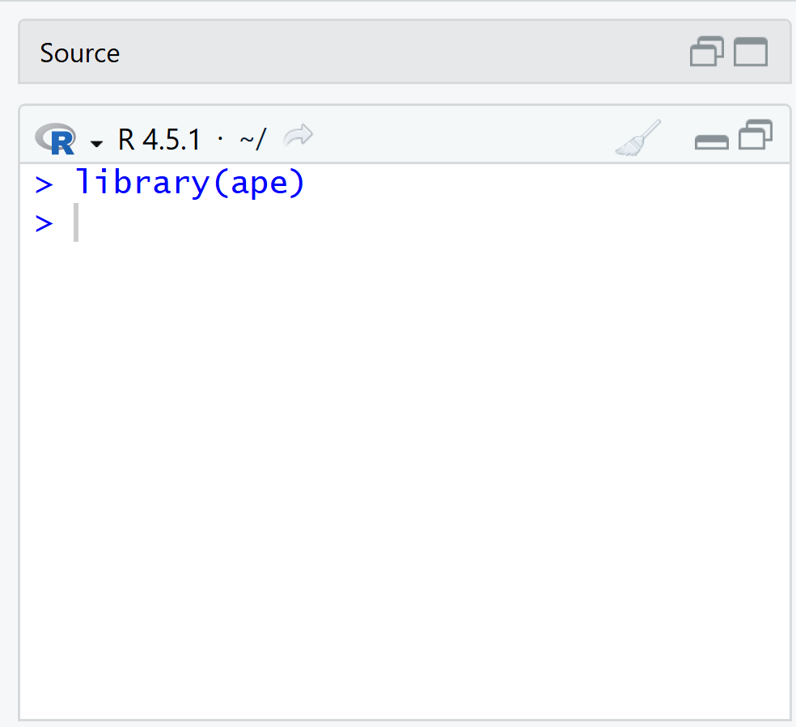

# R para principiantes

*Nota: esta sección está diseñada para estudiantes que no tienen experiencia previa en programación, en espacial a R. Si ya tienes experiencia en programación, puedes saltar esta sección.*

En esta sección, aprenderemos a usar R para trabajar con datos de secuencias de ADN mitocondrial (mtDNA). R es un lenguaje de programación y un entorno de software para análisis estadístico y gráficos. Es ampliamente utilizado en la comunidad científica, especialmente en biología y genética, debido a su capacidad para manejar grandes conjuntos de datos y realizar análisis complejos.

Arriba pueden observar lo que es una interfaz de RStudio. La ventana de la izquierda es la consola. La consola es donde se ejecutan las instrucciones que escribimos en el script. Por ejemplo, si queremos cargar un paquete, tenemos que escribir `library(nombre_del_paquete)` en el script y luego ejecutar esa línea de código para que se cargue el paquete en la consola.

Como notarás, no se ejecuta nada más. !Y eso está bien!. No prestemos por ahora atención sobre los mensajes que aparecen en la consola. Lo importante es que se ejecute la instrucción que escribimos en el script. En este caso, lo que hicimos fue cargar el paquete `ape`, que es un paquete muy útil para trabajar con datos de secuencias de ADN.

La ventana de la derecha es la consola. La consola es donde se ejecutan las instrucciones que escribimos en el script. Por ejemplo, si queremos cargar un paquete, tenemos que escribir `library(nombre_del_paquete)` en el script y luego ejecutar esa línea de código para que se cargue el paquete en la consola.